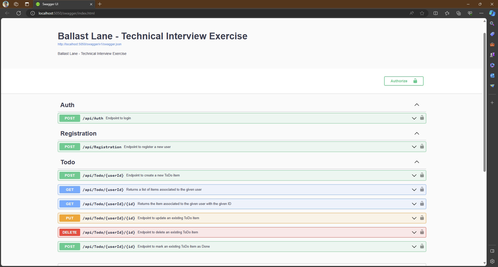
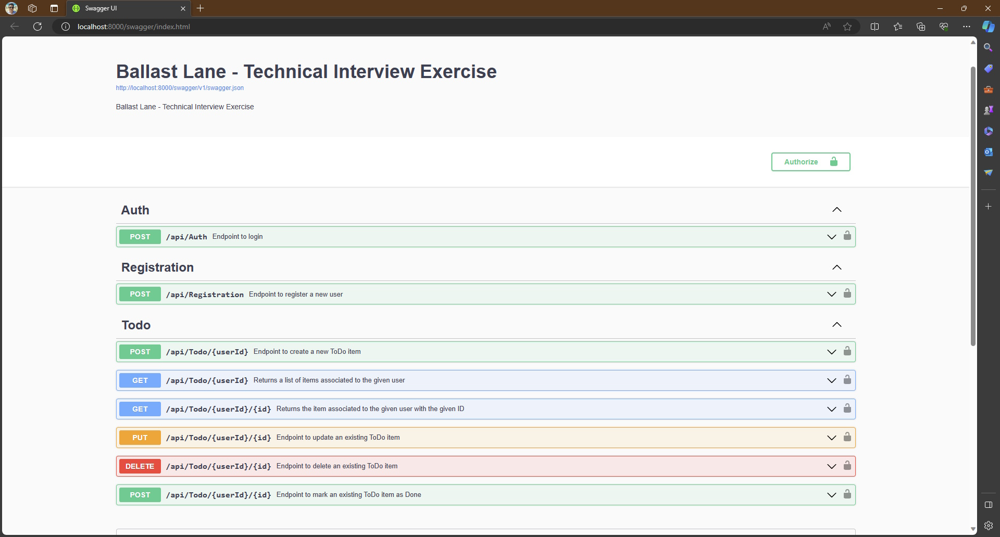

# Ballast Lane Technical Interview Exercise

This repository contains a solution developed as part of the Ballast Lane Technical Interview Exercise.
Please refer to the [instructions and requirements](./docs/Technical%20Interview%20Exercise%20V3.pdf) for more details.

$~$

## Contents

* [Overview](#overview)
* [Implementation Highlights](#implementation-highlights)
* [Prerequisites](#prerequisites)
* [Build and Run](#build-and-run)

$~$

## <a name="overview"></a>Overview

The solution implements a [Clean Architecture](https://learn.microsoft.com/en-us/dotnet/architecture/modern-web-apps-azure/common-web-application-architectures#clean-architecture) with [MongoDb](https://www.mongodb.com/) as the storage system, [Repository Pattern](https://learn.microsoft.com/en-us/dotnet/architecture/microservices/microservice-ddd-cqrs-patterns/infrastructure-persistence-layer-design#the-repository-pattern) and [Fluent Validation](https://docs.fluentvalidation.net/en/latest/), this will have the benefit of easier maintainability and evolution of the app.

The solution is [Containerized using Docker](https://github.com/dotnet-architecture/eShopModernizing/wiki/02.-How-to-containerize-the-.NET-Framework-web-apps-with-Windows-Containers-and-Docker) with Linux containers, so it's ready to be included in a broader [Microservices Oriented Solution](https://learn.microsoft.com/en-us/dotnet/architecture/microservices/multi-container-microservice-net-applications/microservice-application-design) and as part of a [Deployment Pipeline](https://learn.microsoft.com/en-us/dotnet/architecture/devops-for-aspnet-developers/cicd).

$~$

## <a name="implementation-highlights"></a>Implementation Highlights

As requested, the solutions is based in a custom User Story which is to maintain a simple ToDo list.

### User Stories

#### Registration
As a potentital user, I want to be able to self register into the app.
The required information for registration is:
- eMail
- password

In the first iteration there are no explicit requirements for password complexity, but it cannot be empty.
Upon successful registration, the app should assign users a unique ID and save this information for later login.
In the first iteration the password can be saved in plain text.

#### Login
As a registered user I want to be able to login to the app with the same data used for Registration.
Upon login, the app creates an access token that must be used to consume any other API endpoint.
Only one session per user is allowed at any given time.

#### ToDo list
As a registered user, I want to be able manage ToDo items.
I want to be able to retrieve a list of my ToDo items.
After first login, the list is expected to be empty.
I want to be able to perform regular CRUD operations on items.
I also want to mark pending items as Done.

$~$

## <a name="prerequisites"></a>Prerequisites

* .Net 8.0
* Visual Studio 2022
* Docker
* MongoDb (optional)

The solution is based on .Net 8.0 and this decision revolves around the fact that it's the latest [LTS version](https://dotnet.microsoft.com/en-us/platform/support/policy) of .Net

The use of MongoDb is optional, only required if you build and run the solution locally inside Visual Studio, but not required if run in the context of a Docker container. (See [Build and Run](#build-and-run))

$~$

## <a name="build-and-run"></a>Build and Run

Once the repository has been cloned on your local computer, there are at least two options to build and run the solution.

### Using Visual Studio

As noted previously, we'll need MongoDb for this option. One easy solution is to pull a Docker image and run it in a container, you can use this command for that purpose:

```
docker run -d -p 27077:27017 --name mongo-local mongo
```
Plase note we're mapping port 2707 as the solution is also expecting mongo listening on that same port. Also, `mongo-local` is the name we are giving to the container.

Now, back to the solution:

* Using Visual Studio 2022 open the solution _Ballast.Todo.sln_ on the _src_ folder.
* Go to Solution Explorer, right click on the Ballast.Todo.API project and select _Set as Startup Project_.
* Right click again on the Ballast.Todo.API project and select _Build_.
* Once the solution is finished building, go to the _Debug_ menu and select _Start Debugging_ or just hit _F5_.

This will open up a browser (on port 5050) with the OpenAPI documentation where you can acquire a token and start testing the endpoints, or you can test this same behavior by using other tools like Postman.



### Using Docker

* Make sure Docker is up and running
* Using your preferred terminal navigate to the _src_ folder
* Run the following command:

  ```
  docker-compose -f docker-compose.yml -f docker-compose.override.yml up -d --build
  ```

* Once the build finishes, open a browser and navigate to this URL: [http://localhost:8000/swagger/index.html](http://localhost:8000/swagger/index.html)

If this is the first time you run the solution with this approach it can take some minutes to complete as this will download the required container images before building the solution, please be patient.
On subsequent executions you can just use the command 

```
docker-compose -f docker-compose.yml -f docker-compose.override.yml up -d
```



Please note that this URL is different than the one we saw when running from Visual Studio, this is the best indicator that we're running inside a container.